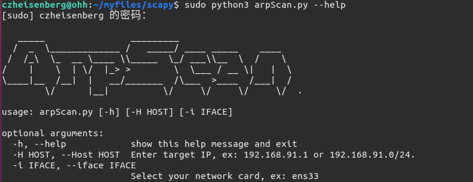

## HOW  TO USE ?

- ping.py

```shell
python3 ping.py --help
```


```shell
python3 ping.py -H 192.168.91.0/24
```


- arpScan.py

```shell
python3 arpScan.py --help
```



```shell
sudo python3 arpScan.py -H 192.168.91.0/24
```


