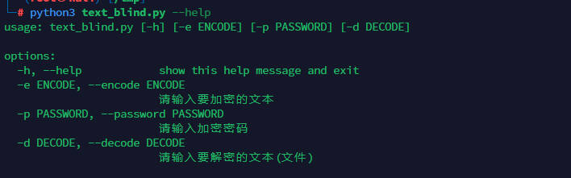
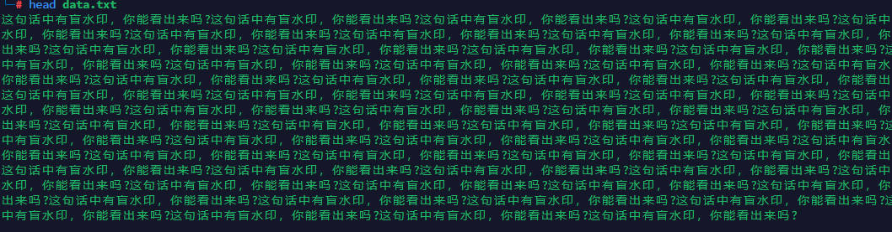

## ＷHAT'S THIS ?

这是一个基于文本盲水印的一个二开（小调用而已）
原作者地址：

https://gitee.com/guofei9987/text_blind_watermark

https://github.com/guofei9987/text_blind_watermark


## HOW TO USER ?
text_blind.py
安装依赖：
```bash
pip3 install text_blind_watermark
```

### help


### 加密文本
```python
python3 text_blind.py -e "flag{6c9667d4-3ded-7530-203e-ec545b232931}" -p "123"
```
执行之后输出到 data.txt文件中，以文件方式保存保证加密数据的完整性
查看加密数据data.txt


### 解密文件
```python
python3 text_blind.py -d "data.txt" -p "123"
```


解密后的文件保存在 decode.txt中,查看


